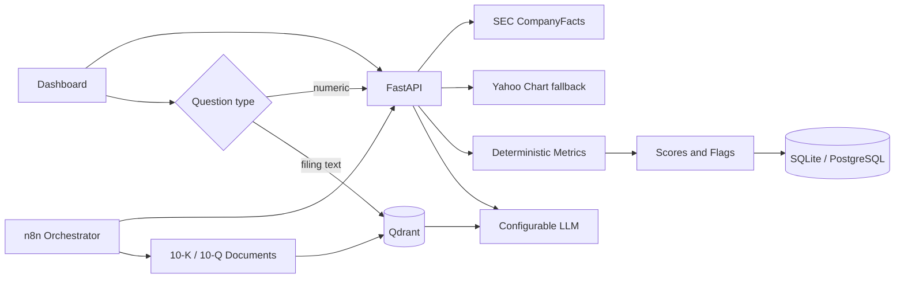

# Morian mimarisi ve dönüşüm planı

## 1. Mevcut mimari

İçe aktarılan `Stock Q&A Workflow` 16 düğümlü iki hat barındırıyor:

1. İndeksleme: Manual Trigger → Google Drive download → Binary Document Loader → Recursive Character Text Splitter → OpenAI Embeddings → Qdrant insert.
2. Soru-cevap: Webhook/manual chat → Retrieval QA Chain. Zincir, Qdrant retriever ve OpenAI Chat Model alt düğümlerini kullanıyor → Respond to Webhook.

Güçlü tarafı belge tabanlı Q&A'nın hazır olmasıdır. Sınırlamaları: sayısal/veri sorularını RAG'den ayıran bir router yok; yapılandırılmış finansal depo, deterministik hesaplama, veri soyu, skorlama, tarama ve fiyat adaptörü bulunmuyor. Sticky note'ta Supabase yazmasına rağmen gerçek düğüm Qdrant; ayrıca collection adı sabit olduğu için şirket/filing metadata disiplini eksik.

## 2. Değiştirilen kısımlar

- Mevcut dosya değişmeden tutuldu; geri dönüş ve karşılaştırma mümkündür.
- Sayısal analiz FastAPI servisindeki deterministik motora taşındı.
- n8n, senkron hesaplayıcı olmaktan çok ingestion/orchestration katmanı olarak konumlandı.
- Belge indekslemede `ticker`, `company`, `filing_type`, `filing_date`, `fiscal_year`, `source` metadata zorunlu hale getirildi.
- LLM'ye yalnızca backend'in ürettiği JSON verilir; prompt açıkça yeni sayı üretmesini yasaklar.

## 3. Yeni mimari

Yerel kurulum SQLite kullanır. Üretimde aynı tablo sınırları PostgreSQL'e taşınmalıdır. Qdrant, yapılandırılmış rakamların ana kaynağı değildir.

## 4. Ücretsiz veri kaynakları

- SEC CompanyFacts: resmi yıllık/çeyreklik GAAP gerçekleri; ana temel veri kaynağı.
- SEC Submissions/Archives: filing listesi, 10-K/10-Q HTML ve XBRL belgeleri.
- Yahoo Finance chart endpoint: fiyat geçmişi için anahtar gerektirmeyen fallback. SLA yoktur; adaptör değiştirilebilir tutulmuştur.
- NASDAQ-100 evreni: üretimde Nasdaq'ın yayımladığı liste veya güvenilir endeks bileşeni kaynağı günlük cache'lenmelidir.

SEC rate limitlerine saygı için kimlikli User-Agent, disk cache, timeout ve hata aktarımı eklenmiştir. Geniş evren taraması n8n batch/schedule ile seri veya kontrollü paralel çalıştırılmalıdır.

## 5. Database schema

`companies`, `financial_statements`, `financial_metrics`, `prices`, `scores`, `analysis`, `filings`, `watchlists`, `watchlist_items` tabloları `app/data/database.py` içinde oluşturulur. Ham statement değerleri dönem bazında JSON tutulurken sorgulanacak normalize metrikler ayrı satırlardır. Her metrikte source/period/filing_date/updated_at alanı vardır. `null`, bilinmeyen veri demektir.

## 6. Scoring modeli

Final ağırlıklar config'dedir: Quality 30, Growth 25, Valuation 20, Health 15, Momentum 10. Alt skorlar 0–100 lineer eşik fonksiyonlarıyla oluşturulur. Quality dağılımı istenen 15/15/20/15/15/10/10 yapısını kullanır. 3Y/5Y büyüme tek yıllık büyümeden daha ağırdır. Valuation; earnings/FCF yield, P/E, EV/EBITDA ve ROIC+büyüme kalite ayarlamasını birlikte kullanır.

Eksik bileşen skor dışı kalır ve ayrı `coverage` alanı döner. Kategori kapsamı %40'ın, ağırlıklı toplam kapsam %60'ın altındaysa skor `null` olur ve şirket sıralamaya alınmaz. Bu, eksikliği sıfır saymadan düşük kanıtlı yüksek skorları engeller. Tarihsel değerleme, beş yıllık fiyat geçmişi ve yıllık SEC EPS verisinden şirketin kendi P/E medyanına göre hesaplanır.

## 7. n8n workflow tasarımı

- `stock-analysis-orchestrator.json`: webhook girdisini `analyze`, `compare`, `screen` işlemlerine ayırıp backend'e yollar.
- `filing-rag-ingestion.json`: Google Drive belgesini metadata ile Qdrant'a indeksleyen mevcut hattın güvenli devamıdır.
- `ai-commentary.json`: hesaplanmış JSON'u değiştirilebilir LLM provider'a yorumlatmak için sözleşme/prompt şablonudur.

Credential kimlikleri export dosyasına gömülmemiştir. İçe aktardıktan sonra n8n arayüzünden credential seçilmelidir.

## 8. Backend yapısı

- `app/data`: SEC, market ve SQL adaptörleri.
- `app/finance`: saf hesaplama, metrik, skorlama ve red flag fonksiyonları.
- `app/services.py`: veri toplama → hesaplama → saklama orkestrasyonu.
- `app/main.py`: analiz, karşılaştırma, screener ve strateji API'leri.

Veri sağlayıcı/LLM değişimi adaptör sınırında yapılır. LLM provider ayarları `.env` içinde bulunur; temel analiz LLM olmadan tamamen çalışır.

## 9. Frontend yapısı

Tek sayfalı, responsive dashboard ticker karşılaştırma, preset screener, sıralama, skor kapsamı ve risk bayraklarını sunar. Sayfa isimleri navigasyonda hazırdır. İlk teslimat çalışan Dashboard/Comparison/Screener çekirdeğine odaklanır; Watchlist tabloları backend şemasında hazırdır. Grafikler için yıllık/çeyreklik seriler analiz API'sinde döndüğünden ECharts/Plotly bağlanabilir.

## Üretim sertleştirme notları

Geniş evren taramasında job queue, PostgreSQL, dağıtık Redis cache, SEC istek bütçesi, retry/backoff, metriğe özgü XBRL taxonomy testleri ve gözlemlenebilirlik eklenmelidir. Banka/sigorta şirketleri için ayrı scoring profili gerekir. Forward P/E/PEG ve kesin tarihsel valuation, SEC'den doğrudan gelmediğinden ücretsiz sağlayıcı bulunduğunda provider alanıyla eklenmeli; bulunmadığında `null` kalmalıdır.
